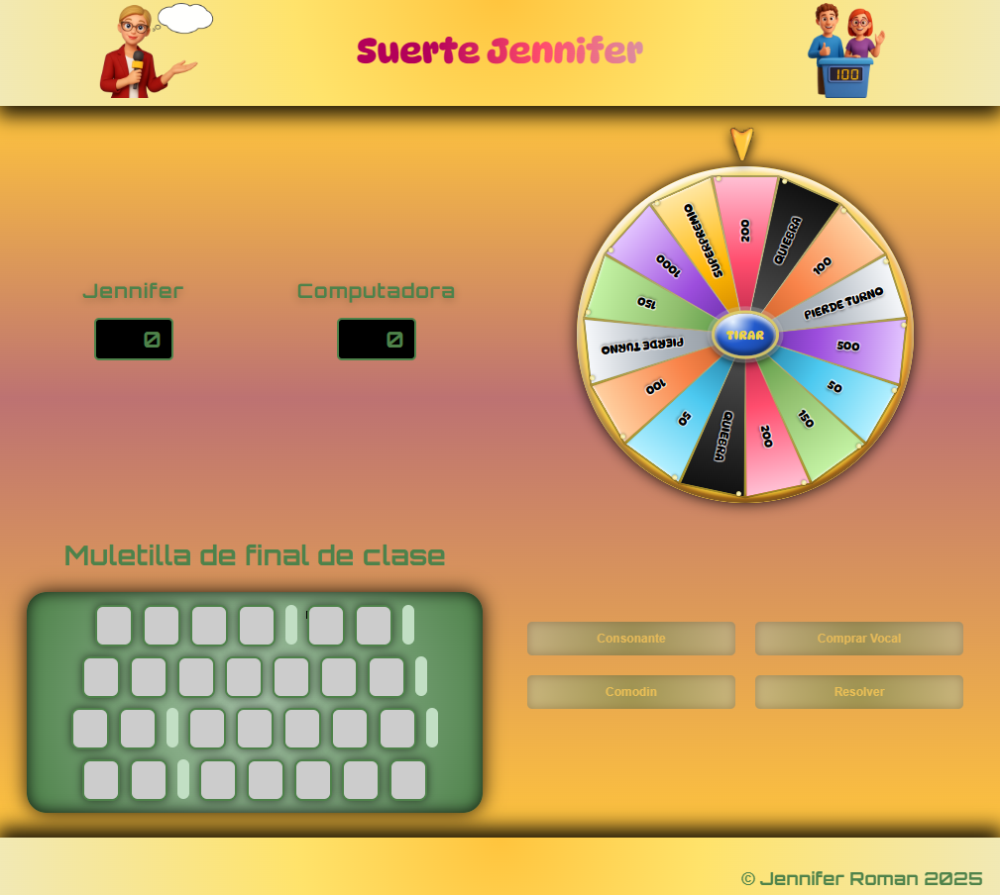

# Spin and Guess (Gira y adivina)

Juego tipo “Ruleta de la suerte”: gira la ruleta, compra vocales, elige consonantes y resuelve la frase. Incluye turnos jugador/computadora, bloqueos de UI para evitar acciones inválidas y un sistema de mensajes (RoundInfo) para guiar cada ronda.

## Capturas


- Página Inicio:


- Página Juego:


## Cómo se juega

1) En la landing introduces tu nombre y empiezas la partida.
2) En la pantalla de juego verás:
   - **Panel**: la frase oculta (casillas) y una pista.
   - **Ruleta**: gajos con valores/premios/penalizaciones.
   - **Controles**: acciones disponibles según el estado actual.
   - **Marcadores**: puntuación de jugador y computadora + mensajes de ronda.

### Giro de ruleta (aleatorio)

- Al pulsar **TIRAR**, la ruleta gira y se detiene en un gajo de forma aleatoria.
- El gajo determina si puedes sumar puntos (gajos “con puntuación”) o si hay penalización/efecto especial.

### Turnos y jugadas

- La partida alterna turnos entre **jugador** y **computadora**.
- En tu turno, normalmente el flujo es:
  1) Girar ruleta
  2) Según el gajo, elegir consonante / comprar vocal / resolver
  3) Si aciertas, puedes seguir; si fallas o toca penalización, cambia el turno
- La computadora juega de forma **automática** (elige letras aleatorias válidas) cuando entra su turno.

### Bloqueos de UI (ruleta/botones)

Para evitar acciones “imposibles” (por ejemplo: girar dos veces seguidas, o elegir letra cuando no toca), el juego activa/desactiva controles según el estado:

- **Ruleta deshabilitada** mientras está girando o cuando el turno está “entregándose” a la computadora.
- **Botones de controles** se habilitan solo cuando la jugada actual lo permite (ej.: tras un gajo con puntuación).
- Los mensajes de **RoundInfo** muestran qué está pasando y ayudan a seguir el flujo (aciertos, fallos, cambio de turno, etc.).

## Diseño responsive

- Layout pensado para mobile primero y ajustes para tablet/desktop.
- El layout principal usa un enfoque “header + main flexible + footer” para ocupar la altura de pantalla sin dejar espacios en blanco.

## Tecnologías

- React + Vite
- React Router
- Sass (SCSS)


## Requisitos

- Node.js (recomendado: LTS)

## Instalación y uso

```bash
npm install
npm run dev
```

## Scripts

- `npm run dev`: servidor de desarrollo
- `npm run build`: build de producción
- `npm run preview`: previsualizar build
- `npm run lint`: ESLint


## Estructura

- `src/components`: componentes (landing, juego, layout)
- `src/styles`: estilos SCSS
- `src/images`: assets importados desde componentes/SCSS
- `public`: assets estáticos (p.ej. `screenshots/` y favicons)

